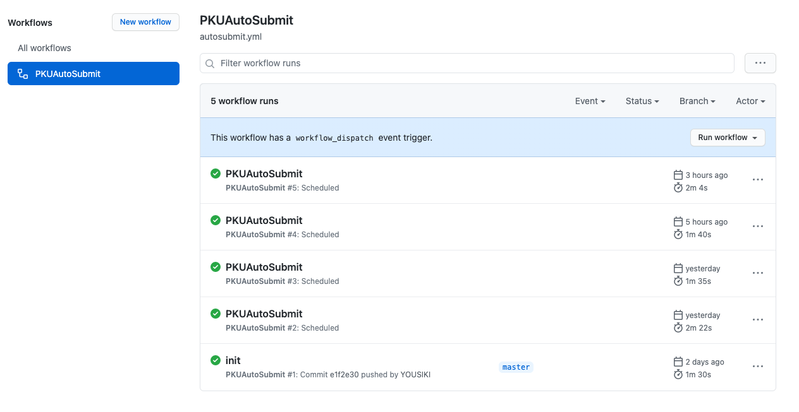
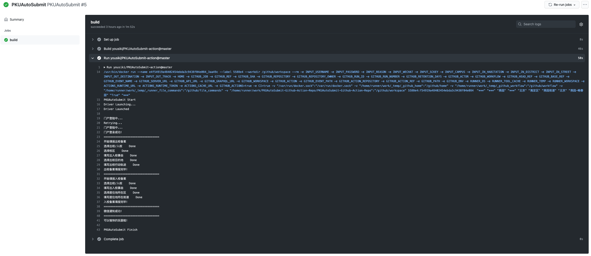

# PKUAutoSubmit-action

百京大学燕园云战役自动填报小助手 Github Action

## 工作原理

本项目只是基于 [PKUAutoSubmit](https://github.com/Bruuuuuuce/PKUAutoSubmit) 做的一点微小的贡献，
将 PKUAutoSubmit 所需的运行环境装进了 Docker 并包上了一层 Github Actions 的糖衣，
这样只需要随意建立一个 Github 仓库，编写一个简单地 Github Actions 配置文件就可以调用 PKUAutoSubmit 了。

## 相较上一代的优点

- 每次运行时都会 Clone 最新的 PKUAutoSubmit 代码，直接跟进上游仓库更新
- 不需要通过 Fork 别人的 Public 仓库来使用，可以在 Private 仓库中配置 Github Actions

## 使用方法

### Step1 建立一个新的 Github 仓库

[创建新的 Github 仓库](https://github.com/new) 并随意填写名称及相关内容。
如果你不希望其他人查看到该仓库，请选择 Private。
不过我不清楚 Private 仓库的 Actions 运行时长是否免费，请自行确认。印象中 Education 认证通过的 Github 账户每月有 3000 min 的时长，足够使用了

### Step2 编写 Github Actions 配置文件

在仓库的 `.github/workflows` 目录下创建新文件 `main.yml`，或者直接在网页中的 Actions 选项卡中创建新的自定义 workflow。
可以仿照[我的配置文件](https://github.com/YOUSIKI/PKUAutoSubmit-Github-Action-Repo/blob/master/.github/workflows/autosubmit.yml)编写你的 workflow。

- `schedule` 部分是用来定时运行的，每日执行两次。
- `username` 就是你的学号。
- `password` 就是你的密码。
- `reason` 就是出入校事由。
- `wechat` 和 `sckey` 配置 Server 酱通知。如果不会用就直接将 `True` 改为 `False` 禁用即可。

更多的参数选项参见 `action.yml`。

### Step3 设置仓库 Secrets

因为学号和密码等内容不适合明文放在仓库中（当然，如果你是 Private 仓库并且心很大的话，当我没说），
我们一般将其作为仓库 Secrects 设置好，并在 `main.yml` 中通过 `${{ secrects.username }}` 这种方式调用。
在此提醒，如果你是 Public 仓库，绝对不要直接在 `main.yml` 中使用明文记录 `username` 和 `password`。

### Step4 手动运行查看结果

在[我的配置文件](https://github.com/YOUSIKI/PKUAutoSubmit-Github-Action-Repo/blob/master/.github/workflows/autosubmit.yml)中，设置了手动运行 workflow 开关。
你可以在如下位置找到开关，手动运行 PKUAutoSubmit：

运行后显示如下结果（“可以愉快的玩耍啦”）才是报备成功：

## 常见问题

写的不是多么完善，请保证所有输入参数都不为空字符串，比如 `reason` 和 `sckey` ，哪怕用不到也写个 `"xxxxxxx"`，不要空着。
